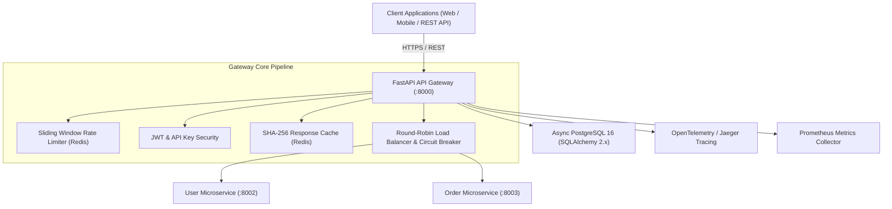

# Production FastAPI API Gateway & Observability Platform

[](https://github.com/amrnath005/production-api-gateway/actions/workflows/ci-cd.yml)
[](LICENSE)
[](https://www.python.org/downloads/)
[](https://fastapi.tiangolo.com/)

A high-performance, production-grade **FastAPI API Gateway** and **10-Service Observability Platform** built with Python 3.12+, PostgreSQL 16, Redis 7, Prometheus, Grafana, Jaeger, OpenTelemetry, pgAdmin 4, and RedisInsight.

Designed with clean architecture, strict typing, resilience patterns (Circuit Breaker, Exponential Backoff Retry, Round-Robin Load Balancing, Sliding Window Rate Limiting), and zero-configuration developer experience.

---

## 🏛️ System Architecture



---

## ⚡ Quick Start (Zero Configuration)

Spin up the entire platform in seconds:

```bash
docker compose up -d
```
*Or using Makefile:*
```bash
make up
```

All 10 services, monitoring dashboards, and database administration GUIs will launch and self-configure automatically.

### Platform Web UIs & Endpoints

| Service | Endpoint URL | Default Credentials | Description |
| :--- | :--- | :--- | :--- |
| **FastAPI Gateway** | `http://localhost:8000` | N/A | Core Gateway Service |
| **Swagger OpenAPI Docs** | `http://localhost:8000/docs` | `admin` / `admin123` | Interactive API documentation |
| **Grafana Dashboards** | `http://localhost:3000` | **Auto-Login as Admin** (`admin`/`admin`) | 10 pre-provisioned operational dashboards |
| **Jaeger Tracing UI** | `http://localhost:16686` | *No Auth Required* | Visual OTLP distributed trace waterfalls |
| **Prometheus Metrics** | `http://localhost:9090` | *No Auth Required* | Metrics collection engine |
| **pgAdmin 4** | `http://localhost:5050` | `admin@admin.com` / `admin` | **Auto-connected** PostgreSQL UI |
| **RedisInsight** | `http://localhost:5540` | *No Auth Required* | **Auto-connected** Redis GUI |

---

## 🌟 Key Features

- **Resilience Engine**: Circuit Breaker state machine, exponential backoff retries with jitter, and background health-monitored load balancing.
- **Low-Latency Acceleration**: SHA-256 Redis response caching with ETag support (`304 Not Modified`) and dynamic Gzip compression.
- **Enterprise Security**: Salted `PBKDF2-HMAC-SHA256` password hashing (100,000 iterations), constant-time API Key validation (`secrets.compare_digest`), and JWT Bearer authorization.
- **Zero-Cardinality Observability**: W3C `traceparent` trace propagation, contextual JSON logging, and normalized low-cardinality Prometheus metrics.

---

## 📚 Documentation Index

The repository features comprehensive CNCF-standard enterprise documentation:

- 📖 **[PROJECT_REPORT.md](PROJECT_REPORT.md)** — Master System Specification & Entry Point
- 🏛️ **[docs/architecture/overview.md](docs/architecture/overview.md)** — Architecture Overview & Design Decisions
- 📖 **[docs/backend/api-reference.md](docs/backend/api-reference.md)** — REST API Reference & Endpoint Specification
- 📊 **[docs/observability/prometheus.md](docs/observability/prometheus.md)** — Metrics & Observability Guide
- 🚀 **[docs/deployment/local-setup.md](docs/deployment/local-setup.md)** — Quick Start & Local Setup Manual
- 🛡️ **[docs/security/security.md](docs/security/security.md)** — Security Architecture & OWASP Mitigation
- 🧪 **[docs/testing/testing.md](docs/testing/testing.md)** — Automated Pytest & Load Test Benchmarks
- 🎓 **[docs/interview/interview-guide.md](docs/interview/interview-guide.md)** — 100+ Software Engineering Interview Q&As

---

## 🤝 Contributing & License

- **Contributing**: Please review [CONTRIBUTING.md](CONTRIBUTING.md) and [docs/development/coding-standards.md](docs/development/coding-standards.md).
- **Code of Conduct**: [CODE_OF_CONDUCT.md](CODE_OF_CONDUCT.md).
- **Security Policy**: [SECURITY.md](SECURITY.md).
- **License**: Released under the [MIT License](LICENSE).
