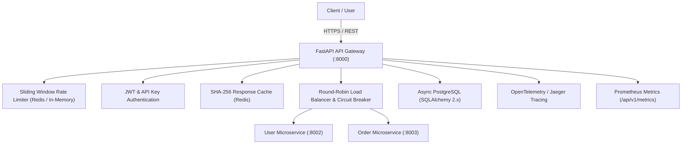

# Production FastAPI API Gateway & Local Observability Platform

A high-performance, production-grade **FastAPI API Gateway** and complete **Local Observability & Operations Stack** built with Python 3.12+, PostgreSQL, Redis, Prometheus, Grafana, Jaeger, OpenTelemetry, pgAdmin 4, and RedisInsight.

Designed with clean architecture, strict typing, resilience patterns (Circuit Breaker, Exponential Backoff Retry, Round-Robin Load Balancing, Rate Limiting), and zero-configuration developer experience.

---

## 🚀 Quick Start (Zero Configuration)

Spin up the entire 10-service platform with a single command:

```bash
docker compose up -d
```
*Or using Makefile:*
```bash
make up
```

All monitoring dashboards, database tools, cache inspectors, and microservices will automatically launch and self-configure.

---

## 🌐 Platform Service Registry & Web UIs

| Service | Local URL | Default Credentials | Description |
| :--- | :--- | :--- | :--- |
| **FastAPI Gateway** | `http://localhost:8000` | N/A | Core API Gateway Service |
| **Swagger OpenAPI Docs** | `http://localhost:8000/docs` | `admin` / `admin123` | Interactive API documentation & testing |
| **Grafana Dashboards** | `http://localhost:3000` | **Auto-Login as Admin** (`admin`/`admin`) | 10 pre-provisioned monitoring dashboards |
| **Jaeger Tracing UI** | `http://localhost:16686` | *No Auth Required* | Visual OTLP distributed trace waterfalls |
| **Prometheus Metrics** | `http://localhost:9090` | *No Auth Required* | Metrics collection & PromQL query engine |
| **pgAdmin 4** | `http://localhost:5050` | `admin@admin.com` / `admin` | **Auto-connected** PostgreSQL Management UI |
| **RedisInsight** | `http://localhost:5540` | *No Auth Required* | **Auto-connected** Redis Key & Memory GUI |
| **PostgreSQL Database** | `localhost:5432` | `gateway` / `gateway_password` | Async Relational DB (`api_gateway`) |
| **Redis Store** | `localhost:6379` | *No Auth Required* | In-memory cache & sliding-window rate limiter |

> 📖 **Complete Documentation**:
> - [docs/FIRST_RUN.md](docs/FIRST_RUN.md) — Beginner step-by-step first run guide.
> - [docs/DEFAULT_CREDENTIALS.md](docs/DEFAULT_CREDENTIALS.md) — Comprehensive service & credential reference table.

---

## 🛡️ Architecture & Features



### Core Engineering Highlights
1. **Resilience Patterns**:
   - **Circuit Breaker**: Auto-trips after failure threshold and transitions to `HALF_OPEN` state.
   - **Retry Service**: Exponential backoff retry with jitter on network/timeout errors.
   - **Load Balancer**: Round-robin request distribution across healthy instances with background health monitoring.
2. **Security & Authentication**:
   - Salted `PBKDF2-HMAC-SHA256` password hashing (100,000 iterations).
   - Constant-time API Key verification (`secrets.compare_digest`).
   - Standard JWT Bearer token generation & verification.
3. **Observability & Monitoring**:
   - OpenTelemetry distributed tracing across FastAPI, HTTPX, Redis, and SQLAlchemy exported to Jaeger.
   - Prometheus metrics endpoint at `/api/v1/metrics` with low-cardinality endpoint normalization.
   - 10 provisioned Grafana dashboards covering Gateway Overview, Latency Quantiles (p50/p95/p99), Database, Redis, Circuit Breaker, Auth, Rate Limiter, and Infrastructure.
4. **Caching & Compression**:
   - Redis-backed GET response caching with SHA-256 hashing and TTL expiration.
   - ETag conditional request support (`304 Not Modified`).
   - Dynamic Gzip HTTP compression.

---

## 🧪 Testing & Verification

Run the unit and integration test suite:

```bash
pytest
```
*Or using Makefile:*
```bash
make test
```

Execute load testing & benchmark suites:
```bash
make benchmark
```

---

## 📁 Repository Documentation Index

- [docs/LOCAL_DEVELOPMENT.md](docs/LOCAL_DEVELOPMENT.md) — Local platform development workflows.
- [docs/FIRST_RUN.md](docs/FIRST_RUN.md) — Beginner step-by-step first run walkthrough.
- [docs/DEFAULT_CREDENTIALS.md](docs/DEFAULT_CREDENTIALS.md) — Full service & credentials list.
- [docs/Architecture.md](docs/Architecture.md) — Mermaid system architecture & sequence diagrams.
- [docs/MONITORING_GUIDE.md](docs/MONITORING_GUIDE.md) — Prometheus metrics reference.
- [docs/OBSERVABILITY_GUIDE.md](docs/OBSERVABILITY_GUIDE.md) — OpenTelemetry & Jaeger tracing guide.
- [docs/GRAFANA_GUIDE.md](docs/GRAFANA_GUIDE.md) — Provisioned Grafana dashboards overview.
- [docs/LOAD_TESTING.md](docs/LOAD_TESTING.md) — k6 & Locust benchmark suite.
- [docs/Deployment.md](docs/Deployment.md) — Production Docker & Kubernetes deployment guide.
