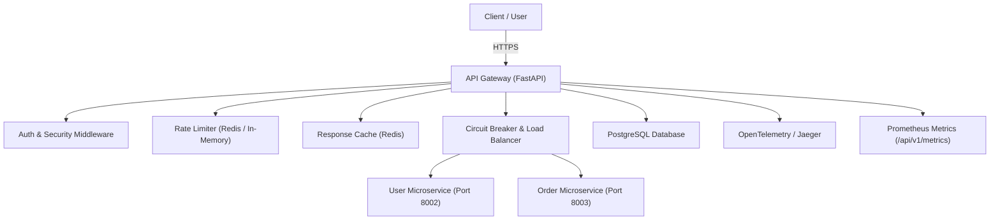
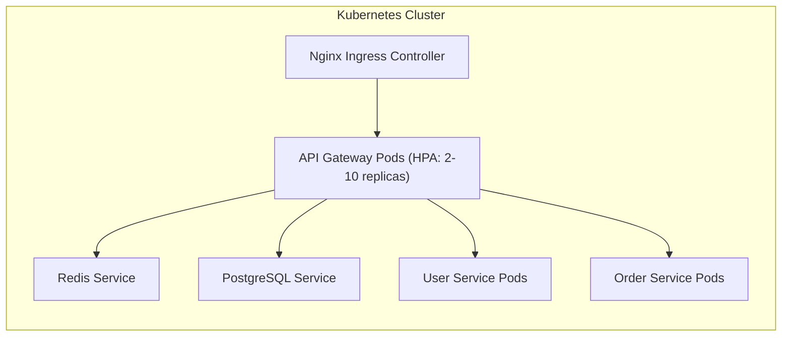
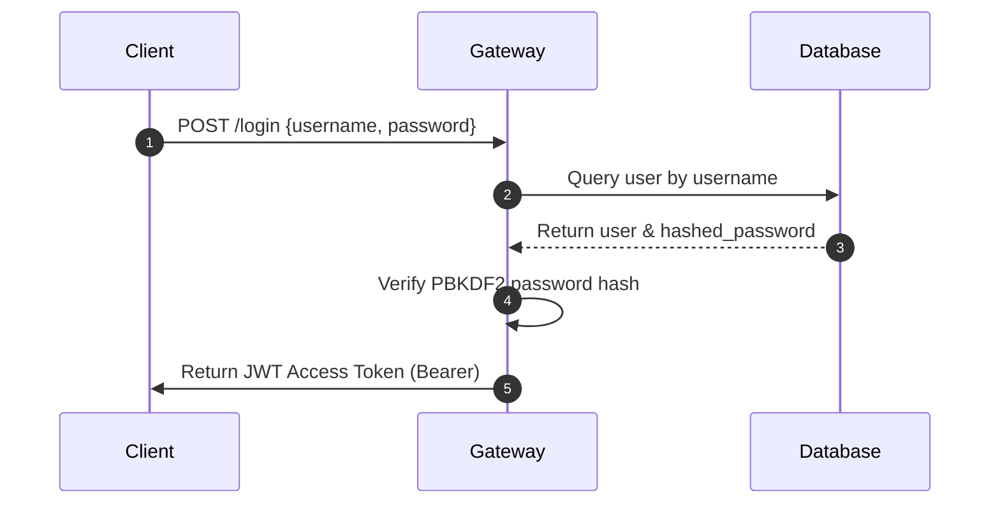
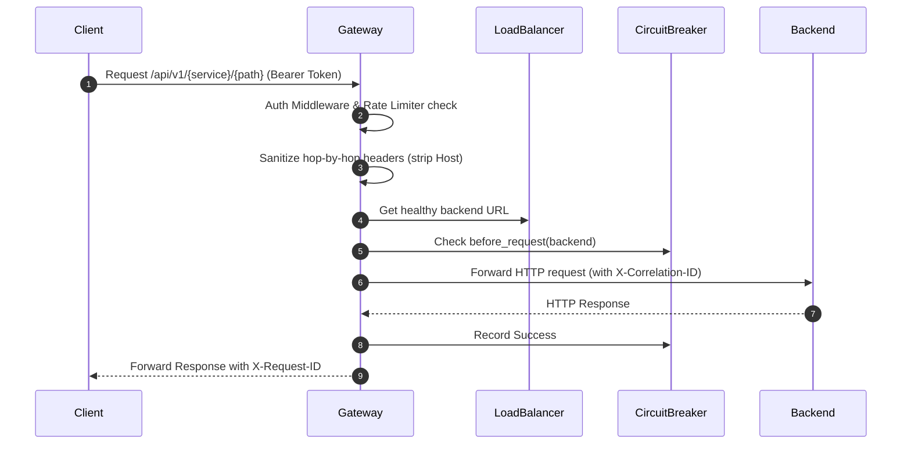
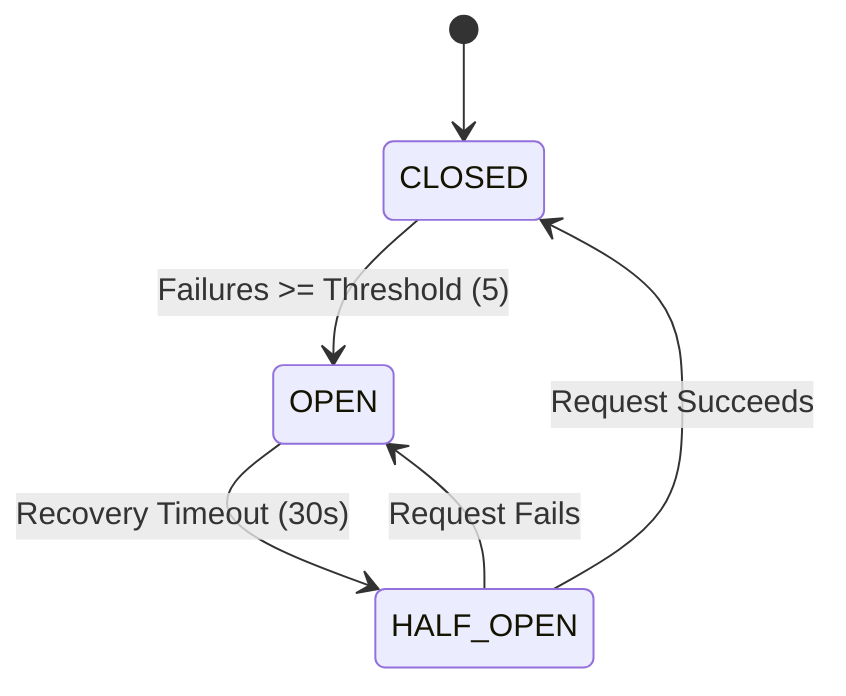
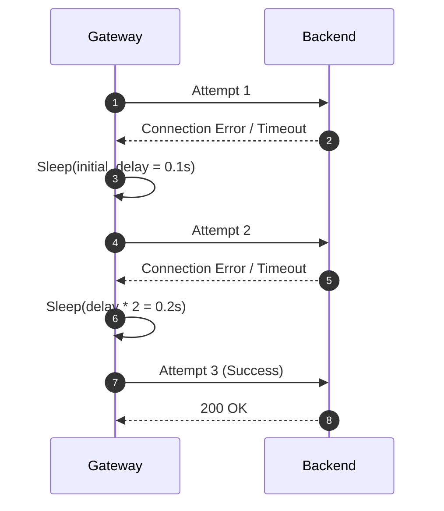
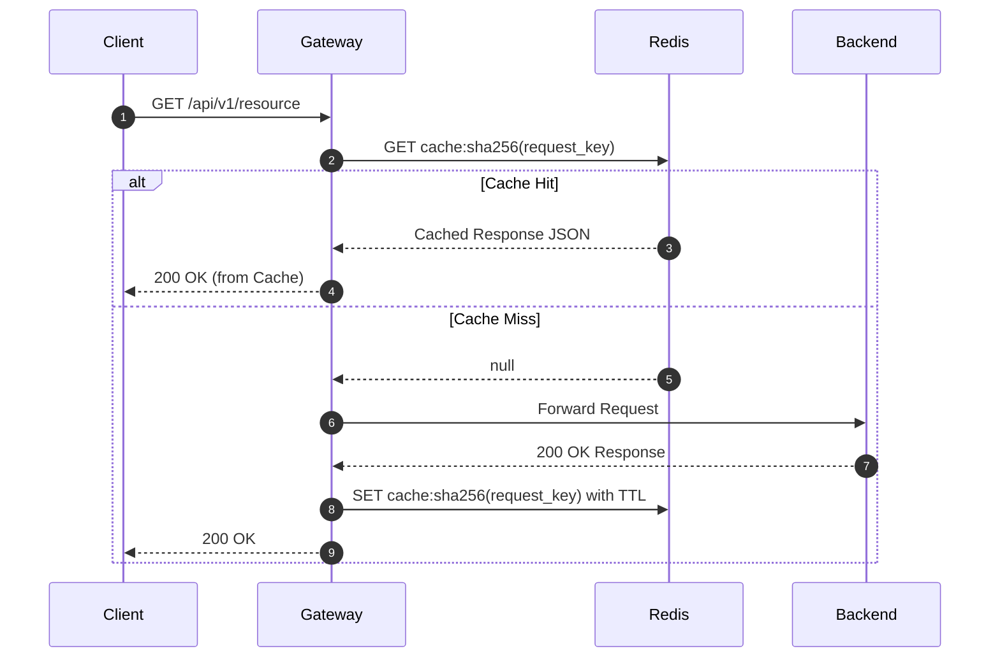
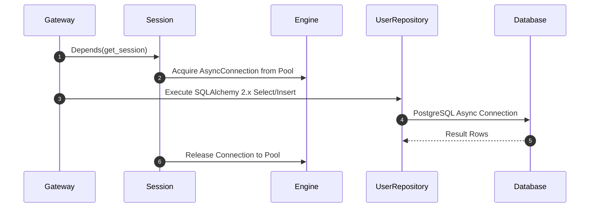

# System Architecture & Design Diagrams

## 1. Component Diagram

## 2. Deployment Diagram

## 3. Authentication Flow

## 4. Gateway Request Proxy Flow

## 5. Circuit Breaker Flow

## 6. Retry Flow

## 7. Redis Cache Flow

## 8. Database Flow

