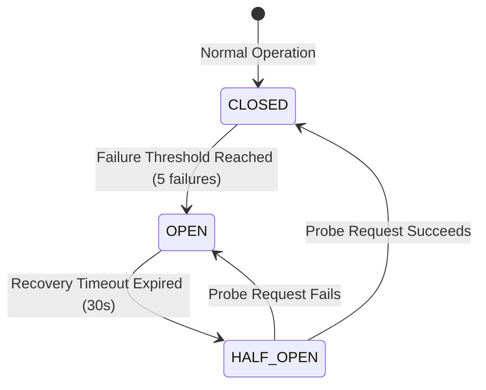
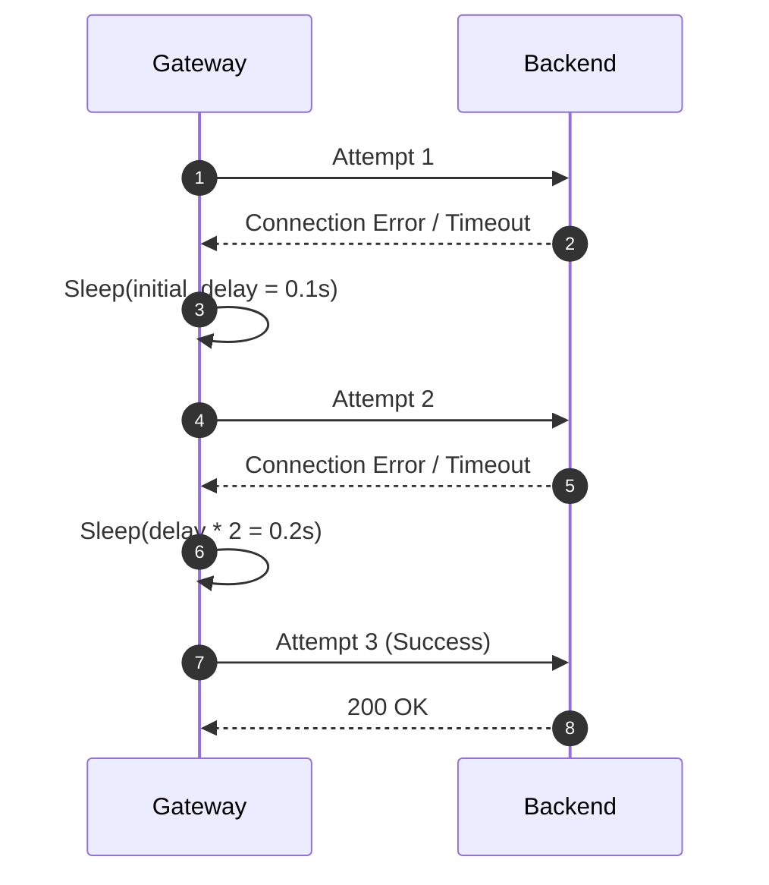
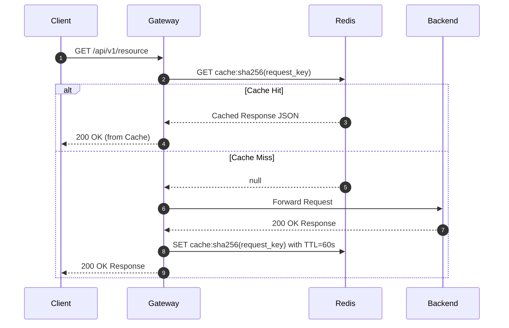
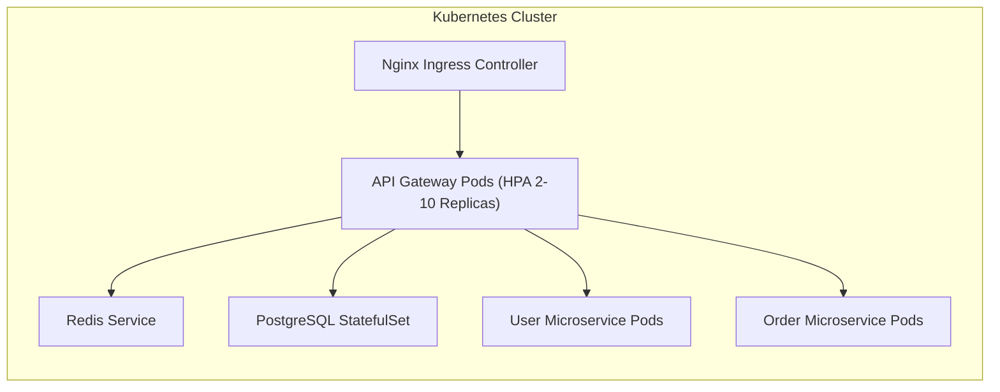

# System Architecture Diagrams

This document collects all architectural Mermaid diagrams illustrating components, state machines, deployment topologies, and caching flows.

---

## 1. Circuit Breaker State Machine

---

## 2. Dynamic Retry Flow

---

## 3. Redis Cache Lookup Flow

---

## 4. Kubernetes Deployment Topology

