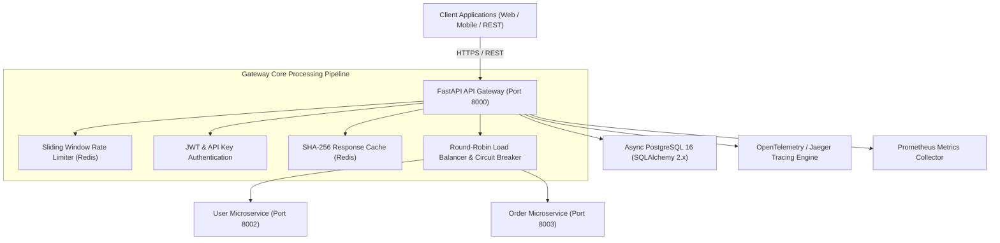

# System Architecture Overview

The **Production FastAPI API Gateway** is a reverse-proxy entrypoint designed to route, secure, balance, cache, trace, and monitor API traffic for distributed microservice architectures.

---

## High-Level Architecture

---

## Core System Goals & Constraints

### Architectural Goals
1. **Single Entry Point**: Consolidates cross-cutting concerns (Auth, Rate Limiting, CORS, Metrics) into a single edge layer.
2. **High Throughput & Async I/O**: Built on Starlette/Uvicorn ASGI using Python 3.12 `async/await` non-blocking execution.
3. **Resilience & Isolation**: Implements Circuit Breaking, Exponential Backoff Retry, and Round-Robin Load Balancing to prevent cascading backend failures.
4. **Zero-Cardinality Observability**: Structured JSON logging, W3C trace propagation, and low-cardinality Prometheus metrics driving 10 Grafana dashboards.

### System Constraints
- **State Offloading**: Gateway instances remain stateless, delegating shared state (rate limits, response cache) to Redis.
- **Header Forwarding**: Hop-by-hop HTTP headers are stripped before forwarding requests downstream.
