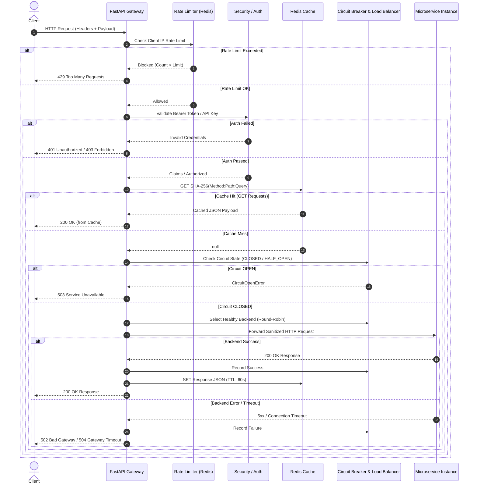

# End-to-End Request Flow & Trace Propagation

This document details the lifecycle of an HTTP request as it traverses the API Gateway processing pipeline.

---

## Request Execution Lifecycle

---

## Context & Trace Header Propagation

When an HTTP request enters the Gateway:
1. **Request ID Assignment**: `log_requests` middleware assigns a UUID `request_id` and reads or generates `X-Correlation-ID`.
2. **OpenTelemetry Context**: An active 128-bit `trace_id` is initialized in OpenTelemetry.
3. **Downstream Propagation**: The Gateway builds correlation headers for microservices via `build_correlation_headers()`:
   - `X-Request-ID`: Unique per-request identifier.
   - `X-Correlation-ID`: End-to-end multi-service transaction correlation ID.
   - `X-Trace-ID`: Hexadecimal trace string.
   - `traceparent`: W3C trace context format (`00-{trace_id}-{span_id}-01`).
