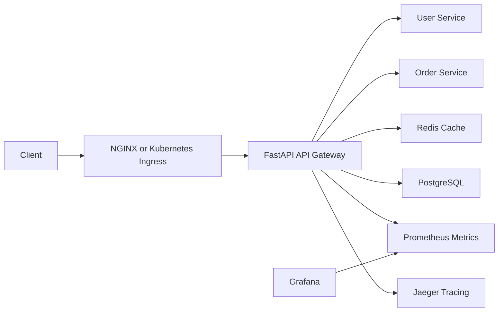

# Final Architecture

## Runtime layers

- FastAPI gateway with authentication, rate limiting, proxying, retries, circuit breaker behavior, cache support, metrics, tracing, and structured logging.
- PostgreSQL persistence through SQLAlchemy async sessions, pooled connections, repositories, and Alembic migrations.
- Redis cache for response caching and cache invalidation.
- Prometheus, Grafana, and Jaeger for observability.
- Docker Compose for local production-like operation.
- Kubernetes for production orchestration with health probes, resource controls, ingress, and autoscaling.
- GitHub Actions for CI/CD, automated tests, security scanning, image publishing, and optional deployment.
