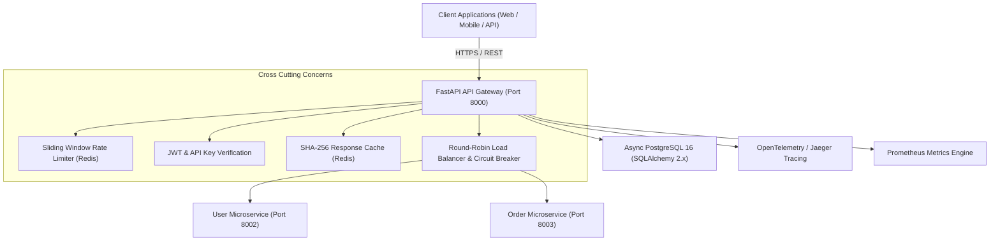
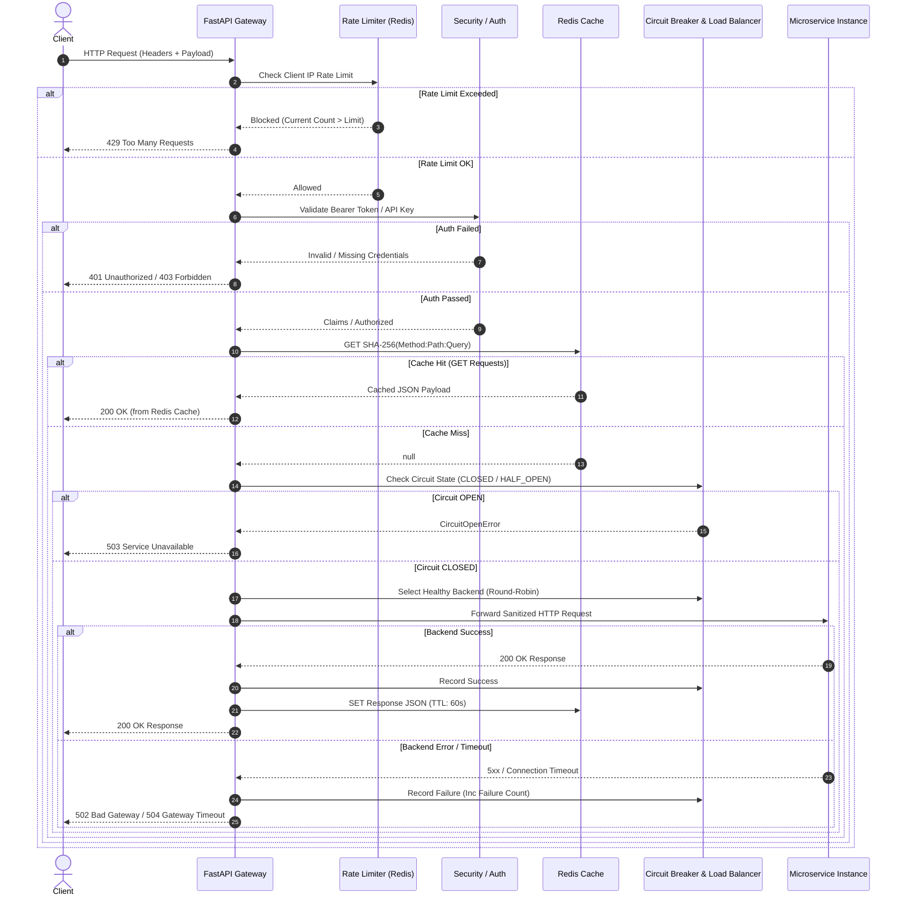
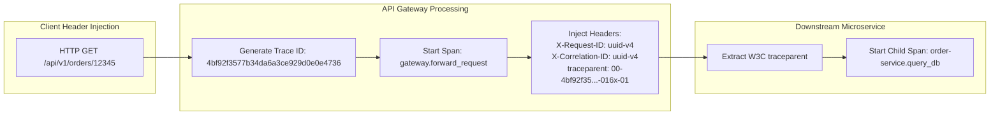

# Enterprise Software Engineering Design Document (SEDD)
## Volume 1: System Architecture, Design Patterns & Real-World Use Cases

---

## Section 4: Problem Statement & Architectural Justification

### 4.1 Why an API Gateway?
In modern microservices architectures, backend systems are decomposed into dozens or hundreds of decoupled services. Allowing client applications (mobile apps, single-page web applications, third-party API consumers) to communicate directly with individual microservices introduces severe architectural liabilities:

```
[ Un-Gatewayed Direct Microservices Communication (Anti-Pattern) ]

              +-------------------+
              | Client Application|
              +---------+---------+
                        |
        +---------------+---------------+
        |               |               |
        v               v               v
  +-----------+   +-----------+   +-----------+
  |  User     |   |  Order    |   | Inventory |
  | Service   |   | Service   |   | Service   |
  +-----------+   +-----------+   +-----------+
  (Exposes IP)    (Exposes IP)    (Exposes IP)
```

#### Key Vulnerabilities of Direct Communication:
1. **Network Overhead & Latency**: Clients must execute multiple HTTP round-trips to aggregate data across different microservices.
2. **Coupling & Leakage**: Internal microservice IP addresses, database schemas, and private endpoints are exposed to the public internet.
3. **Duplicated Cross-Cutting Concerns**: Authentication, authorization, rate limiting, CORS, SSL termination, and request logging must be reimplemented independently in every single microservice.
4. **Protocol Mismatch**: Downstream services may use high-performance internal protocols (gRPC, Protobuf, TCP sockets) that browsers cannot easily consume.

### 4.2 Architectural Solution: Centralized API Gateway
The **Production FastAPI API Gateway** resolves these challenges by introducing a unified, reverse-proxy entry point:



---

## Section 5: Real-World Enterprise Use Cases

| Industry Sector | Enterprise Context | Gateway Feature Utilized | Value Delivered |
| :--- | :--- | :--- | :--- |
| **FinTech & Banking** | Payment Processing APIs | API Key Verification & Rate Limiting | Prevents brute-force attacks and enforces strict tier-based rate limits on account transactions. |
| **E-Commerce & Retail** | Flash Sales & Product Catalog | SHA-256 Redis Response Caching & ETag | Serves 10,000+ GET requests/sec directly from memory with `< 2ms` latency, offloading downstream microservices. |
| **Logistics & Fleet (Uber/FedEx)** | Driver Location Updates | Circuit Breaker & Exponential Retry | Automatically isolates unhealthy backend instances, retrying transient network timeouts without failing client requests. |
| **Healthcare & Telemedicine** | Patient Records Access | JWT Bearer Authentication & OpenTelemetry Tracing | Mandates token signature verification and generates W3C `traceparent` headers for HIPAA compliance auditing. |
| **Defense & Aerospace (ISRO/DRDO)** | Telemetry Data Distribution | Structured JSON Logging & Low-Cardinality Prometheus Metrics | Provides real-time operational visibility into subsystem metrics and error budgets without high-cardinality degradation. |

---

## Section 7: System Architecture & Request Lifecycles

### 7.1 High-Level Request Lifecycle Diagram



---

## Section 20: End-to-End Request Lifecycle & Trace Propagation

### 20.1 Distributed Trace Propagation Protocol



1. **Client Request Arrival**: The incoming HTTP request is intercepted by `log_requests` middleware in `app/middleware/logging.py`.
2. **Context Creation**: A unique 128-bit OpenTelemetry `trace_id` and 64-bit `span_id` are initialized alongside `request_id` and `correlation_id`.
3. **Header Sanitization & Injection**: Hop-by-hop headers (`Host`, `Connection`, `Transfer-Encoding`) are stripped, while `X-Request-ID`, `X-Correlation-ID`, `X-Trace-ID`, and standard W3C `traceparent` headers are injected into the forwarded HTTP request.
4. **Jaeger OTLP Export**: The span tree is asynchronously batched and transmitted to Jaeger at `http://jaeger:14268/api/traces`.
