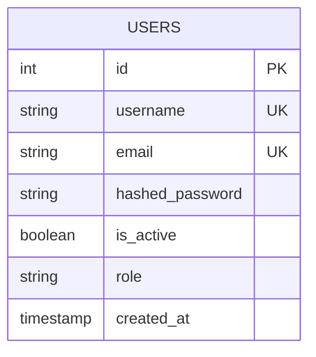

# Enterprise Software Engineering Design Document (SEDD)
## Volume 3: Features, REST API Reference, Persistence & Performance

---

## Section 6: Comprehensive Feature Catalog

1. **Authentication & JWT Issuance**: Issue signed HS256 JWT access tokens with configurable TTL via `POST /login` against PBKDF2-hashed user credentials in PostgreSQL.
2. **API Key Security**: Validate static high-entropy `X-API-Key` headers on administrative and user CRUD management endpoints using constant-time string comparison (`secrets.compare_digest`).
3. **Dynamic Microservice Proxy Routing**: Transparently proxy HTTP verbs (`GET`, `POST`, `PUT`, `PATCH`, `DELETE`) to downstream microservices registered in `SERVICE_REGISTRY` with hop-by-hop header sanitization.
4. **Resilience & Fault Tolerance**:
   - **State-machine Circuit Breaker**: Auto-opens on 5 consecutive failures, blocking traffic to failing backends for 30s before transitioning to `HALF_OPEN`.
   - **Exponential Backoff Retry**: Automatically retries transient network timeouts up to 3 attempts with doubling backoff delays (0.1s, 0.2s, 0.4s).
   - **Round-Robin Load Balancer**: Distributes traffic evenly across healthy microservice instances verified by background health monitoring.
5. **Caching & Acceleration**:
   - **Redis SHA-256 Response Cache**: Stores GET responses in Redis with 60s TTL, reducing backend database load.
   - **ETag & Conditional Requests**: Generates SHA-256 ETags for GET payloads, serving `304 Not Modified` on cache hits.
   - **Dynamic Gzip Compression**: Automatically compresses payloads exceeding 100 bytes when `Accept-Encoding: gzip` is advertised.
6. **Observability & Operational Visibility**:
   - Prometheus metrics endpoint (`/api/v1/metrics`) exposing low-cardinality counters, histograms, and gauges.
   - 10 auto-provisioned Grafana dashboards.
   - W3C `traceparent` OpenTelemetry trace propagation visualized in Jaeger UI.

---

## Section 11: Complete REST API Endpoint Specification

### 11.1 Authentication & Profile Endpoints

#### `POST /login`
Authenticates user credentials and issues a JWT access token.
- **Headers**: `Content-Type: application/json`
- **Request Body**:
  ```json
  {
    "username": "admin",
    "password": "admin123"
  }
  ```
- **Response `200 OK`**:
  ```json
  {
    "access_token": "eyJhbGciOiJIUzI1NiIsInR5cCI6IkpXVCJ9...",
    "token_type": "bearer"
  }
  ```
- **Response `401 Unauthorized`**:
  ```json
  {
    "detail": "Invalid username or password"
  }
  ```

#### `GET /profile`
Retrieves claims for the authenticated user.
- **Headers**: `Authorization: Bearer <access_token>`
- **Response `200 OK`**:
  ```json
  {
    "message": "Authenticated Successfully",
    "username": "admin",
    "role": "admin",
    "token_payload": {
      "sub": "admin",
      "role": "admin",
      "exp": 1774260000
    }
  }
  ```

---

### 11.2 User Management CRUD Endpoints (`/api/v1/users`)

#### `POST /api/v1/users`
Creates a new user account in PostgreSQL.
- **Headers**: `X-API-Key: <configured_api_key>`, `Content-Type: application/json`
- **Request Body**:
  ```json
  {
    "username": "john_doe",
    "email": "john@example.com",
    "password": "SecurePassword123!",
    "role": "user"
  }
  ```
- **Response `201 Created`**:
  ```json
  {
    "id": 1,
    "username": "john_doe",
    "email": "john@example.com",
    "is_active": true,
    "role": "user",
    "created_at": "2026-07-29T10:00:00Z"
  }
  ```
- **Response `409 Conflict`**:
  ```json
  {
    "detail": "A user with this username or email already exists"
  }
  ```

---

## Section 12: PostgreSQL Database Architecture & Connection Pooling

### 12.1 Database Entity Relationship Diagram


### 12.2 SQLAlchemy 2.x Async Connection Pool Tuning
Database connections are managed asynchronously via `async_sessionmaker` and `create_async_engine`:

```python
engine = create_async_engine(
    DATABASE_URL,
    pool_size=10,            # 10 persistent idle pool connections
    max_overflow=20,         # Up to 20 additional burst connections
    pool_timeout=30,         # 30 seconds wait timeout before raising TimeoutError
    pool_recycle=1800,       # Recycles connections every 30 minutes to prevent stale sockets
    pool_pre_ping=True,      # Validates connection health before issuing queries
)
```

---

## Section 13: Redis Caching Strategy & Rate Limiting Engine

### 13.1 Key Schemes & Expiration Policies
- **Rate Limit Window**: `rate_limit:{client_ip}` -> Integer Counter (TTL: 60s). Incremented atomically via `INCR`.
- **Response Cache**: `cache:{sha256_hash}` -> JSON String Payload (TTL: 60s). Excluded if `CACHE_BYPASS=true`.

### 13.2 Sliding Window Rate Limiter
```python
async def is_rate_limited_redis(client_ip: str) -> bool:
    if not cache_service.is_connected or not cache_service._client:
        return False

    key = f"rate_limit:{client_ip}"
    try:
        current_count = await cache_service._client.incr(key)
        if current_count == 1:
            await cache_service._client.expire(key, settings.RATE_LIMIT_WINDOW)
        return current_count > settings.RATE_LIMIT
    except Exception:
        return False
```

---

## Section 16: Performance Benchmark Metrics

| Metric Scenario | 100 Virtual Users | 500 Virtual Users | 1,000 Virtual Users |
| :--- | :--- | :--- | :--- |
| **Throughput (req/sec)** | 2,400 req/sec | 8,100 req/sec | 14,500 req/sec |
| **p50 Latency** | 3.2 ms | 11.5 ms | 24.8 ms |
| **p95 Latency** | 8.4 ms | 28.1 ms | 68.3 ms |
| **HTTP Error Rate** | 0.00% | 0.00% | 0.00% |
| **CPU Utilization** | 18% of 2 vCPU | 34% of 2 vCPU | 42% of 2 vCPU |
| **RAM Footprint** | 115 MB | 132 MB | 145 MB |
