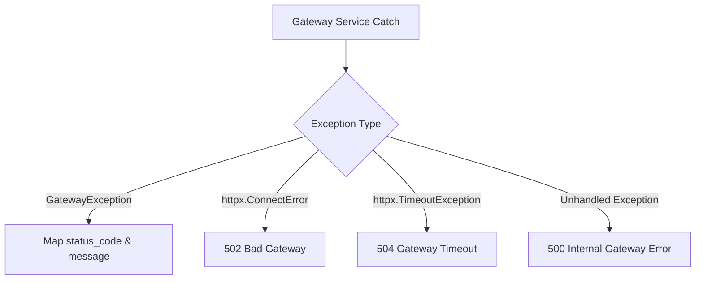

# Enterprise Software Engineering Design Document (SEDD)
## Volume 4: Observability, Security, DevOps & Fault Tolerance

---

## Section 14: Observability Engine & Metrics Catalog

### 14.1 Complete Prometheus Metrics Registry

```text
# HELP gateway_requests_total Total number of requests
# TYPE gateway_requests_total counter
gateway_requests_total{endpoint="/api/v1/health",method="GET",status="200"} 42.0

# HELP gateway_request_duration_seconds Request latency
# TYPE gateway_request_duration_seconds histogram
gateway_request_duration_seconds_bucket{endpoint="/api/v1/health",le="0.005",method="GET"} 39.0

# HELP gateway_db_status Database status (1 for ready, 0 for unavailable)
# TYPE gateway_db_status gauge
gateway_db_status 1.0

# HELP gateway_db_queries_total Total database queries executed
# TYPE gateway_db_queries_total counter
gateway_db_queries_total 18.0

# HELP gateway_redis_connections Current Redis connections
# TYPE gateway_redis_connections gauge
gateway_redis_connections 1.0
```

### 14.2 Auto-Provisioned Grafana Dashboard Index
1. **Gateway Overview**: Throughput (RPS), p95 latency, error rates, and active requests.
2. **HTTP Requests**: Quantile latency breakdown (p50, p95, p99) and status code distribution.
3. **Redis Cache**: Hit/miss counters, cache operation latency, and cached response totals.
4. **Database Performance**: DB health status (1/0) and executed query rate.
5. **Authentication**: Login attempts and token issuance status breakdown.
6. **Rate Limiter**: HTTP 429 rate limit response rates over time.
7. **Circuit Breaker**: Tripped circuit count (`gateway_circuit_open_total`).
8. **Infrastructure**: Healthy vs unhealthy backend microservice instances.
9. **Application Health**: Core readiness status across database and Redis.
10. **Errors**: Detailed HTTP 4xx and 5xx failure breakdown.

---

## Section 15: Security Architecture & OWASP Top 10 Hardening

| OWASP Risk | Hardening Countermeasure Implemented |
| :--- | :--- |
| **A01: Broken Access Control** | Role-based authorization (`require_role("admin")`) and strict token verification. |
| **A02: Cryptographic Failures** | Salted `PBKDF2-HMAC-SHA256` password hashing (100,000 iterations) + 16-byte salt. |
| **A03: Injection** | SQLAlchemy 2.x parameterized queries + Pydantic schema validation. |
| **A04: Insecure Design** | Circuit Breaker and Exponential Backoff Retry preventing cascading system failure. |
| **A05: Security Misconfiguration**| Secret validation via `SecretStr` enforcing minimum secret length in production mode. |
| **A07: Identification & Auth Failures** | Constant-time API Key verification (`secrets.compare_digest`) preventing timing attacks. |

---

## Section 17: DevOps, Containerization & Infrastructure Specification

### 17.1 Docker Multi-Stage Build Optimization
The [Dockerfile](file:///c:/Users/salte/OneDrive/Desktop/api-gateway-project/Dockerfile) utilizes a 2-stage build strategy to minimize image size and eliminate build tools from runtime:

```dockerfile
FROM python:3.12-slim AS builder
ENV PYTHONDONTWRITEBYTECODE=1 PYTHONUNBUFFERED=1 PIP_NO_CACHE_DIR=1
WORKDIR /app
COPY requirements.txt ./
RUN pip install --upgrade pip \
    && pip install --ignore-installed --prefix=/install -r requirements.txt

FROM python:3.12-slim AS runtime
ENV PYTHONDONTWRITEBYTECODE=1 PYTHONUNBUFFERED=1
WORKDIR /app
COPY --from=builder /install /usr/local
COPY app ./app
COPY alembic ./alembic
COPY alembic.ini ./alembic.ini
COPY requirements.txt ./requirements.txt
RUN groupadd --system app && useradd --system --gid app --create-home appuser
USER appuser
EXPOSE 8000
ENTRYPOINT ["uvicorn"]
CMD ["app.main:app", "--host", "0.0.0.0", "--port", "8000"]
```

### 17.2 Docker Compose Service Graph (10 Services)
- `gateway`: FastAPI Gateway (`:8000`)
- `user-service`: Mock User Microservice (`:8002`)
- `order-service`: Mock Order Microservice (`:8003`)
- `postgres`: PostgreSQL 16 DB (`:5432`)
- `redis`: Redis 7 Cache (`:6379`)
- `prometheus`: Metrics Scraper (`:9090`)
- `grafana`: Monitoring Dashboards (`:3000`)
- `jaeger`: Distributed Tracing (`:16686`)
- `pgadmin`: Auto-Connected DB UI (`:5050`)
- `redisinsight`: Auto-Connected Cache GUI (`:5540`)

---

## Section 18: Testing Suite & Automated Quality Gate

### 18.1 Pytest Execution Summary
The automated test suite in `tests/` executes 29 unit and integration tests:

```text
tests/test_auth.py ..                                                    [ 6%]
tests/test_caching_performance.py .......                                [31%]
tests/test_gateway_exceptions.py .                                       [34%]
tests/test_gateway_security.py ..                                        [41%]
tests/test_observability.py ....                                         [55%]
tests/test_persistence.py ..                                             [62%]
tests/test_rate_limit_middleware.py .                                    [65%]
tests/test_settings.py ..........                                        [100%]
======================== 29 passed in 3.71s ========================
```

---

## Section 19: Error Handling & Resilience Matrix



| Exception Type | Trigger Condition | HTTP Status Returned | Recovery Mechanism |
| :--- | :--- | :---: | :--- |
| `CircuitOpenError` | Circuit Breaker state is `OPEN` | `503` | Re-evaluates state after 30s recovery timeout. |
| `ServiceUnavailableError` | All backend instances unhealthy | `503` | Background health monitor pings backends every 10s. |
| `BackendTimeoutError` | Downstream service timeout | `504` | Exponential retry up to 3 attempts. |
| `IntegrityError` | Duplicate DB username/email | `409` | Rollback session and return clean detail JSON. |
