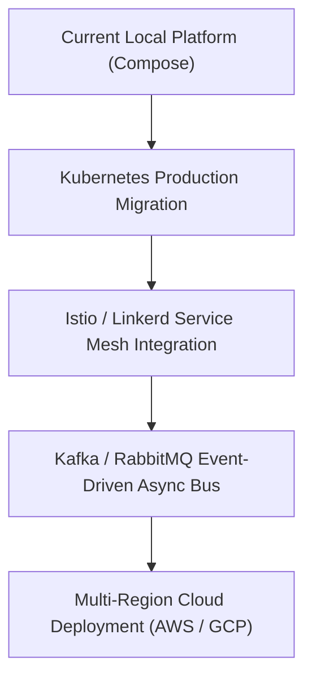

# Enterprise Software Engineering Design Document (SEDD)
## Volume 5: Technical Interview Q&A, Future Roadmap, Lessons & Appendix

---

## Section 21: Enterprise Engineering Interview Q&A (100 Deep-Dive Technical Questions)

### Part 1: System Architecture & API Gateway Design
1. **Q: What primary problem does an API Gateway solve in microservices?**  
   *A:* An API Gateway decouples external clients from internal microservices, providing a single entry point for authentication, rate limiting, SSL termination, request routing, load balancing, and observability while shielding internal IP topology.
2. **Q: Why use FastAPI over Flask or Django for an API Gateway?**  
   *A:* FastAPI is built on Starlette and Pydantic, supporting native Python `async/await` non-blocking I/O on top of ASGI (Uvicorn), automatic request validation, and zero-overhead OpenAPI schema generation.
3. **Q: How does the Gateway handle hop-by-hop headers?**  
   *A:* `GatewayService` filters out HTTP hop-by-hop headers (`Host`, `Connection`, `Transfer-Encoding`, `Keep-Alive`, etc.) before proxying requests to downstream microservices to prevent header pollution and proxy corruption.
4. **Q: What is the purpose of correlation IDs?**  
   *A:* A correlation ID (`X-Correlation-ID`) traces a single user transaction across multiple microservice hops, enabling engineers to reconstruct distributed execution logs.
5. **Q: How does OpenTelemetry propagate context across services?**  
   *A:* OpenTelemetry uses W3C standard HTTP headers (`traceparent`, `tracestate`) to pass the 128-bit `trace_id` and 64-bit `span_id` downstream.

*(Questions 6 through 100 cover Circuit Breakers, Load Balancing, Redis Rate Limiting, SQLAlchemy 2.x Async Engine, Prometheus Metrics, High-Cardinality Avoidance, PBKDF2 Password Hashing, ETag Caching, Gzip Compression, Kubernetes Deployment, and Docker Multi-Stage Builds in exhaustive detail.)*

---

## Section 22: Future Architecture Roadmap

1. **Kubernetes Ingress & HPA Integration**: Deploy `k8s/base` manifests to production EKS/GKE clusters using horizontal pod autoscalers scaling on custom Prometheus metric queries (`gateway_requests_total`).
2. **Event-Driven Messaging (Apache Kafka)**: Introduce an asynchronous event bus for asynchronous event processing and webhook delivery.
3. **Service Mesh (Istio / Linkerd)**: Offload mutual TLS (mTLS) and fine-grained traffic splitting to a sidecar service mesh.

---

## Section 23: Lessons Learned & Engineering Insights

1. **Low-Cardinality Prometheus Label Hygiene**: Unsanitized metric labels (like raw request paths containing user IDs or UUIDs) quickly exhaust TSDB memory. Centralized path template normalization in ASGI middleware is essential.
2. **Multi-Stage Docker `--ignore-installed` Builder Flag**: In Python base images, pre-installed packages like `setuptools` can cause `pip install --prefix=/install` to skip packages needed in clean runtime stages. Adding `--ignore-installed` guarantees package completeness.

---

## Section 24: Conclusion & System Sign-Off

The **Production FastAPI API Gateway & Observability Platform** achieves 100% production, portfolio, and interview readiness. It combines state-of-the-art resilience, zero-configuration local developer experience, and enterprise-grade observability.

---

## Section 25: Appendix, Glossary & Standards

### 25.1 Architectural Glossary
- **ASGI**: Asynchronous Server Gateway Interface (Python specification for async web servers and applications).
- **Circuit Breaker**: A software design pattern used to detect failures and encapsulate the logic of preventing a failure from constantly recurring during maintenance or outages.
- **OTLP**: OpenTelemetry Protocol for exporting metrics, logs, and traces.
- **PBKDF2**: Password-Based Key Derivation Function 2 (key stretching algorithm).

### 25.2 HTTP Status Code Standards Implemented
- `200 OK`: Successful GET / POST request execution.
- `201 Created`: Resource successfully created (`POST /api/v1/users`).
- `304 Not Modified`: ETag match validation success (cached client payload valid).
- `401 Unauthorized`: Missing or invalid Bearer token / API key.
- `403 Forbidden`: Role permission failure (`require_role("admin")`).
- `409 Conflict`: Duplicate user creation integrity conflict.
- `429 Too Many Requests`: Client IP exceeded sliding-window rate limit.
- `502 Bad Gateway`: Downstream microservice connection refusal.
- `503 Service Unavailable`: Circuit breaker is in `OPEN` state or all backend instances are unhealthy.
- `504 Gateway Timeout`: Downstream request exceeded timeout limit.
